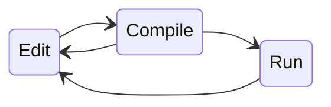

# Introduction

<!--
ESP-IDF projects are built from components. Some of the components are provided by ESP-IDF itself, and additional components may be added to the project. Since very early versions of IDF it was possible to include components from other sources. You could do this by adding components as submodules into the project `components` directory. You could also use Make or CMake to fetch the component from another repository. Or, you could use EXTRA_COMPONENT_DIRS build system variable to point to another directory where the component is located.

Last year, we have introduced IDF Component Manager and IDF Component Registry, which is another way of distributing components developed for ESP-IDF.

IDF Component Registry acts as a place where Espressif and other developers can upload their components. IDF Component Manager is used by ESP-IDF to download components from the Registry or from private Git repositories.

You can already find many components in the registry and use them in your projects.
-->

---
layout: default
---

# Outline

<!--
What I will talk about today is how you can create your own components and share them with other developers, publicly or within your company.

We will cover the following topics:
- Best practices for creating a component
- Releasing and distributing a component
- Maintaining a component

Let's get started with developing a component.
-->

---

# Demo component

<!-- In this talk, for illustration purposes I will be using a simple component, XXXX. You can find the source code in this repository. At the bottom of each slide where I introduce a new aspect of this component you will see a link to the corresponding commit.
This component is fairly simple: (describe what it does)

TODO: Add a link and a QR code.
  -->

---

# Creating the new component

<RenderWhen context="main">
  <Asciinema src="casts/create-component.cast" :playerProps="{speed: 2, rows: 5}"/>
</RenderWhen>

<br>

<div class="grid grid-cols-2 gap-2">

<div v-click>

```
📂 pa1010d/
├── 🔧 CMakeLists.txt
├── 📜 pa1010d.c
└── 📂 include/
    └── 📜 pa1010d.h
```

</div>

<div v-click>

###### CMakeLists.txt

```cmake
idf_component_register(SRCS "pa1010d.c"
                       INCLUDE_DIRS "include")
```

</div>

<div v-click>

###### include/pa1010d.h

```c
void func(void);
```

</div>

<div v-click>

###### pa1010d.c

```c
#include <stdio.h>
#include "pa1010d.h"

void func(void)
{
}
```

</div>

</div>
<!-- To get started, we'll use `idf.py create-component` command. This creates a component CMakeLists.txt file, a source file, and a header file. -->

---

# Filling the code in


<div class="grid grid-cols-2 gap-2">

<div v-click>

###### include/pa1010d.h

```c
#pragma once

#include "esp_err.h"
#include "driver/i2c.h"

#ifdef __cplusplus
extern "C" {
#endif

typedef struct {
    i2c_port_t i2c_port;
    uint8_t i2c_dev_addr;
} pa1010d_config_t;

typedef struct pa1010d_t *pa1010d_handle_t;

esp_err_t pa1010d_init(const pa1010d_config_t *config, pa1010d_handle_t *out_handle);
esp_err_t pa1010d_deinit(pa1010d_handle_t handle);
esp_err_t pa1010d_get_nmea_msg(pa1010d_handle_t handle, char *out_buf, size_t out_buf_len, unsigned timeout_ms);

#ifdef __cplusplus
}
#endif

```

</div>

<div v-click>

###### pa1010d.c

```c
#include <stdio.h>
#include "pa1010d.h"
#include "esp_log.h"
#include "esp_check.h"
#include "driver/i2c.h"

struct pa1010d_t {
    pa1010d_config_t config;
    /* no other state to store for now */
};

esp_err_t pa1010d_init(const pa1010d_config_t *config, pa1010d_handle_t *out_handle)
{
    struct pa1010d_t *result = calloc(1, sizeof(struct pa1010d_t));
    if (result == NULL) {
        return ESP_ERR_NO_MEM;
    }
    result->config = *config;
    *out_handle = result;
    return ESP_OK;
}
esp_err_t pa1010d_deinit(pa1010d_handle_t handle)
{
    free(handle);
    return ESP_OK;
}

static esp_err_t read_one_byte(pa1010d_handle_t handle, char *out_byte, unsigned timeout_ms)
{
    return i2c_master_read_from_device(
        handle->config.i2c_port, handle->config.i2c_dev_addr, (uint8_t*) out_byte, 1, pdMS_TO_TICKS(timeout_ms));
}

esp_err_t pa1010d_get_nmea_msg(pa1010d_handle_t handle, char *out_buf, size_t out_buf_len, unsigned timeout_ms)
{
    char c;
    size_t len = 0;
    esp_err_t err;

    if (out_buf_len < 4) {
        return ESP_ERR_INVALID_ARG;
    }

    do {
        err = read_one_byte(handle, &c, timeout_ms);
        if (err != ESP_OK) {
            return err;
        }
    } while(c != '$');

    out_buf[len++] = c;

    do {
        err = read_one_byte(handle, &c, timeout_ms);
        if (err != ESP_OK) {
            return err;
        }
        out_buf[len++] = c;
    } while(c != '\r' && len < out_buf_len - 1);

    out_buf[len] = '\0';

    return ESP_OK;
}
```

</div>
</div>


<!-- I already wrote the code for this device in another project, so I will simply copy it into the header and the source file. Show the result.
-->

<style>
.slidev-layout pre, .slidev-layout code {
    max-height: 330px;
}
</style>

---

# Compiling and running the code

<div class="flex justify-center my-2">



</div>

<div class="bg-slate-100 p-2 my-4">
<mdi-help-rhombus /> Which application do we compile the component in?
</div>


<div class="grid grid-rows-2 grid-cols-2 gap-2">

<div v-click>

### 1. An example

```
📂 pa1010d/
├── 🔧 CMakeLists.txt
├── 📜 pa1010d.c
├── 📂 include/
│   └── 📜 pa1010d.h
└── 📂 examples/
    └── 📁 pa1010d-example/
```

</div>

<div v-click>

### 2. A test application

```
📂 pa1010d/
├── 🔧 CMakeLists.txt
├── 📜 pa1010d.c
├── 📂 include/
│   └── 📜 pa1010d.h
└── 📁 test_apps/
```

</div>


<div v-click class="text-sm">

* Place one or more example applications inside `examples/`
* IDF Component Manager can create a project from an example
* `examples/` is the default location, can be customized

</div>


<div v-click class="text-sm">

* Place one or more test applications inside `test_apps/`
* `test_apps` name is not fixed, just used by convention in IDF

</div>


</div>

<!-- Okay, now we have the component, how do we check that it works? We can create a test application, or example, or both. Let's create an example, first. -->

---

# Creating an example

<RenderWhen context="main">
  <Asciinema src="casts/create-project.cast" :playerProps="{speed: 2, rows: 6}"/>
</RenderWhen>

<div class="grid grid-cols-2 gap-2 my-2">

<div>

```ini {1-5|6-11}
📂 pa1010d/
├── 🔧 CMakeLists.txt
├── 📜 pa1010d.c
├── 📂 include/
│   └── 📜 pa1010d.h
└── 📂 examples/
    └── 📂 pa1010d-example/
        ├── 🔧 CMakeLists.txt
        └── 📂 main/
            ├── 🔧 CMakeLists.txt
            └── 📜 pa1010-example.c
```

</div>
</div>

---

# Example boilerplate

<div class="grid grid-rows-2 grid-cols-2 gap-2">


<div>

```ini {6-11}
📂 pa1010d/
├── 🔧 CMakeLists.txt
├── 📜 pa1010d.c
├── 📂 include/
│   └── 📜 pa1010d.h
└── 📂 examples/
    └── 📂 pa1010d-example/
        ├── 🔧 CMakeLists.txt
        └── 📂 main/
            ├── 🔧 CMakeLists.txt
            └── 📜 pa1010-example.c
```

</div>
<div>

###### CMakeLists.txt
```cmake
cmake_minimum_required(VERSION 3.16)

include($ENV{IDF_PATH}/tools/cmake/project.cmake)
project(pa1010d-example)
```

</div>
<div>

###### main/CMakeLists.txt
```cmake
idf_component_register(SRCS "pa1010d-example.c"
                    INCLUDE_DIRS ".")
```

</div>

<div>

###### main/pa1010d-example.c
```c
#include <stdio.h>

void app_main(void)
{

}
```

</div>

</div>


---

# Adding a dependency from example to the component

<div class="grid grid-rows-2 grid-cols-2 gap-2">

<div>

###### idf_component.yml

```yaml{1-3|5-7|all}
dependencies:
  igrr/pa1010d:
    version: "*"

    # For local development, use the local
    # copy of the component:
    override_path: '../../../'
```

</div>

<div>

```ini {10,1}
📂 pa1010d/
├── 🔧 CMakeLists.txt
├── 📜 pa1010d.c
├── 📂 include/
│   └── 📜 pa1010d.h
└── 📂 examples/
    └── 📂 pa1010d-example/
        ├── 🔧 CMakeLists.txt
        └── 📂 main/
            ├── 🧩 idf_component.yml
            ├── 🔧 CMakeLists.txt
            └── 📜 pa1010-example.c
```

</div>

<div class="col-span-2">

<div class="bg-slate-100 p-2 my-4 text-lg">
<mdi-information-variant-circle /> idf_component.yml file:
</div>

* Metadata file for the IDF Component Manager ([Reference <mdi-launch /> ](https://docs.espressif.com/projects/idf-component-manager/en/latest/reference/manifest_file.html))
* Contains information about this component *(not in this case)*
* Defines dependencies on other components *(this case)*


</div>
</div>

---

# Adding example code

<div class="grid grid-cols-2 gap-2">

<div>

###### CMakeLists.txt

```cmake {all|3|all}
cmake_minimum_required(VERSION 3.16)

set(COMPONENTS main)
include($ENV{IDF_PATH}/tools/cmake/project.cmake)
project(pa1010d-example)
```

</div>

<div>

###### main/pa1010d-example.c

```c {all|4|8-23|25-30|32-40|all} {lines:true}
#include <stdio.h>
#include "esp_log.h"
#include "driver/i2c.h"
#include "pa1010d.h"

static const char* TAG = "example";

void app_main(void)
{
    i2c_config_t i2c_config = {
        .mode = I2C_MODE_MASTER,
        .sda_io_num = 21,
        .scl_io_num = 22,
        .master.clk_speed = 100000,
    };

    ESP_ERROR_CHECK(
        i2c_param_config(I2C_NUM_0, &i2c_config));

    ESP_ERROR_CHECK(
        i2c_driver_install(I2C_NUM_0,
                           I2C_MODE_MASTER,
                           0, 0, 0));

    pa1010d_config_t config = {
        .i2c_port = I2C_NUM_0,
        .i2c_dev_addr = 0x10,
    };
    pa1010d_handle_t handle = NULL;
    ESP_ERROR_CHECK(pa1010d_init(&config, &handle));

    char nmea_msg_buf[200];
    while (true) {
        pa1010d_get_nmea_msg(handle,
                             nmea_msg_buf,
                             sizeof(nmea_msg_buf),
                             1000);

        ESP_LOGI(TAG, "Got message: '%s'", nmea_msg_buf);
    }
}
```

</div>
</div>


<!-- I already wrote the code for this device in another project, so I will simply copy it into the header and the source file. Show the result.
-->

<style>
.slidev-layout pre, .slidev-layout code {
    max-height: 330px;
}
</style>

---

# Building the example

<RenderWhen context="main">
  <Asciinema src="casts/flash-example.cast" :playerProps="{speed: 1, rows: 15}"/>
</RenderWhen>

---

# Adding component manifest

<div class="grid grid-cols-2 gap-2">


<div>

###### idf_component.yml
```yaml {all|1|3|5-9|10-11|13-15|all}
version: 0.0.2

description: PA1010D I2C GPS driver

url: https://github.com/igrr/pa1010d
issues: https://github.com/igrr/pa1010d/issues
documentation: https://github.com/igrr/pa1010d/tree/main/README.md
repository: https://github.com/igrr/pa1010d.git

maintainers:
  - "Ivan Grokhotkov <ivan@espressif.com>"

dependencies:
  # Requires i2c_master_read_from_device added in v4.4
  idf: ">=4.4.0"
```

[Reference <mdi-launch /> ](https://docs.espressif.com/projects/idf-component-manager/en/latest/reference/manifest_file.html)

</div>

```ini {1,13}
📂 pa1010d/
├── 🔧 CMakeLists.txt
├── 📜 pa1010d.c
├── 📂 include/
│   └── 📜 pa1010d.h
├── 📂 examples/
│   └── 📂 pa1010d-example/
│       ├── 🔧 CMakeLists.txt
│       └── 📂 main/
│           ├── 🧩 idf_component.yml
│           ├── 🔧 CMakeLists.txt
│           └── 📜 pa1010-example.c
└── 🧩 idf_component.yml
```

</div>

---

# Uploading to Component Registry

Once the component is ready, let's upload it:

<v-clicks>

1. Sign in to [components.espressif.com <mdi-launch />](https://components.espressif.com/users/login) via Github
2. Use `compote registry login` command to create and save the token
3. Use `compote component upload --dry-run` to check if the manifest has any errors
4. Use `compote component upload` to upload the version
5. Open https://components.espressif.com/components/NAMESPACE/COMPONENT to see the result
</v-clicks>

---
layout: iframe-right
url: >-
  https://components.espressif.com/components/igrr/pa1010d/versions/0.0.2
class: text-left
---

# Check the result

###### idf_component.yml
```yaml
version: 0.0.2

description: PA1010D I2C GPS driver

url: https://github.com/igrr/pa1010d
issues: https://github.com/igrr/pa1010d/issues
documentation: https://github.com/igrr/pa1010d/tree/main/README.md
repository: https://github.com/igrr/pa1010d.git

maintainers:
  - "Ivan Grokhotkov <ivan@espressif.com>"

dependencies:
  # Requires i2c_master_read_from_device added in v4.4
  idf: ">=4.4.0"
```


---

# Other manifest fields

<div class="grid grid-cols-2 gap-2">

<div>

* `targets`: to limit the chips the component is compatible with. E.g. `[esp32, esp32s2]`
* `version`: component version, if not using Git tags
* `files`: file patterns to `include` or `exclude` when uploading the component
* `examples`: location of example projects
* `discussion`: URL of the project forum or chat

[Reference <mdi-launch /> ](https://docs.espressif.com/projects/idf-component-manager/en/latest/reference/manifest_file.html)

</div>

<div>

###### Example

[idf_component.yml from ESP-DSP <mdi-launch /> ](https://github.com/espressif/esp-dsp/blob/master/idf_component.yml)

```yml
version: "1.4.7"

description: ESP-DSP is the official DSP library for Espressif SoCs.
url: https://github.com/espressif/esp-dsp
repository: https://github.com/espressif/esp-dsp.git
documentation: https://docs.espressif.com/projects/esp-dsp/en/latest/index.html
issues: https://github.com/espressif/esp-dsp/issues

examples:
  - path: ./applications/azure_board_apps/apps
  
files:
  exclude:
    - "**/Makefile"
    - "**/component.mk"
    - "docs/**/*"
    - "test/**/*"
    - "test_app/**/*"

dependencies:
  # Required IDF version
  idf: ">=4.2"
```

</div>
</div>

<style>
.slidev-layout pre, .slidev-layout code {
    max-height: 330px;
}
</style>


---

# Other parts of the component

<v-clicks>

* CMakeLists.txt, source files, header files [(reference <mdi-launch />)](https://docs.espressif.com/projects/esp-idf/en/latest/esp32/api-guides/build-system.html)
* Example and test applications
* idf_component.yml [(reference <mdi-launch />)](https://docs.espressif.com/projects/idf-component-manager/en/latest/reference/manifest_file.html)
  - To describe the component
  - To declare dependencies on other components
* Kconfig file [(reference <mdi-launch />)](https://docs.espressif.com/projects/esp-idf/en/latest/esp32/api-reference/kconfig.html#introduction)
  - To add configuration options (menuconfig)
* `sdkconfig.rename` file [(reference <mdi-launch />)](https://docs.espressif.com/projects/esp-idf/en/latest/esp32/api-reference/kconfig.html#backward-compatibility-of-kconfig-options)
  - For backward compatibility of Kconfig option names
* Linker fragment file [(reference <mdi-launch />)](https://docs.espressif.com/projects/esp-idf/en/latest/esp32/api-guides/linker-script-generation.html)
  - To place functions or data into specific memory regions
* SBOM manifest [(beta <mdi-launch />)](https://github.com/espressif/esp-idf-sbom#manifest-file)

</v-clicks>


---

# Managing compatibility with IDF

Different major releases of IDF may have incompatible APIs [(see migration guides <mdi-launch />)](https://docs.espressif.com/projects/esp-idf/en/latest/esp32/migration-guides/index.html)

<div class="grid grid-cols-2 gap-4">

<div>

#### Dependencies

<div class="text-sm">
Add another dependency only for specific IDF versions.
</div>
</div>

```yml
  espressif/mdns:
    version: "^1.0.0"
    rules:
      - if: "idf_version >=5.0"
```

<div>

#### Build system

<div class="text-sm">
Compile certain source files only for specific IDF versions.
</div>
</div>

```cmake
if("${IDF_VERSION_MAJOR}.${IDF_VERSION_MINOR}"
    VERSION_LESS "4.4")
  target_sources(${COMPONENT_LIB} PRIVATE "compat_v4_3.c")
endif()
```

<div>

#### Code

<div class="text-sm">
Call functions, initialize structure fields depending on IDF version.
</div>

</div>

```c
dev_config_t config = {
    .unit = DEV_UNIT_0,
#if ESP_IDF_VERSION >= ESP_IDF_VERSION_VAL(5, 0, 0)
    .freq = DEV_FREQ_MAX
#else
};
```

</div>

---

<div class="grid grid-cols-2 gap-4">
<div>

# Recap

So far, we have:

* Created a component
* Added an example
* Added a manifest
* Uploaded an initial version manually

</div><div v-click>

# Next steps

* Versioning the component
* Private components
* Setting up component repository
* Uploading releases automatically
* Setting up CI
* Managing contributions
* Adding documentation

</div></div>

---

# Versioning

[Versioning scheme <mdi-launch />](https://docs.espressif.com/projects/idf-component-manager/en/latest/reference/versioning.html) is similar to [semver <mdi-launch />](https://semver.org/):

```
major.minor.patch~revision-prerelease+build
```

<div v-click class="bg-slate-100 p-2 my-4">
<mdi-help-rhombus /> Where to store the version?
</div>

<div class="grid grid-cols-2 gap-4">

<div v-click>

#### Single component repository

<br>

* Use Git tags to identify releases
* No `version:` field in `idf_component.yml`
* The version is determined by the tag
* Upload a new version to the registry for every tag

</div>

<div v-click>

#### Multiple components in a repository

<br>

* Add `version:` field to `idf_component.yml`
* Try to upload new version on every commit
* Use `compot component upload --allow-existing`
  * Or the official Github Action

</div>

<div v-click>

Example: [esp32-camera <mdi-launch />](https://github.com/espressif/esp32-camera)
</div>

<div v-click>

Example: [idf-extra-components <mdi-launch />](https://github.com/espressif/idf-extra-components/)
</div>

</div>

---

# Side note: private components

```yml {all|1-2|3-4|6-7|9-11|all}
dependencies:
  pa1010d:
    # Git repository (over SSH or HTTPS)
    git: "ssh://git@github.com/igrr/pa1010d.git"

    # Commit ID or tag
    version: 5e0448e8e4ac88bc99a95a3bd6e4f58c0e154404

    # Subdirectory inside the repository,
    # if the component is not in the root directory
    path: "."
```

---

# Side note: combining dependencies

```yml{all|1-3|5-10|12-15|all}
dependencies:
  # Dependency from the registry
  espressif/libpng: "*"

  # This component is not in the registry yet,
  # but can be added using Git
  epd_driver:
    version: 221f068d781ef0e6df7db3cd7cf9bca4b83233e9
    path: src/epd_driver
    git: https://github.com/vroland/epdiy.git

  # Local dependency.
  # This is similar to setting EXTRA_COMPONENT_DIRS.
  protocol_examples_common:
    path: $IDF_PATH/examples/common_components/protocol_examples_common
```

---

# Setting up component repository

```ini {1-13|14-17}
📂 pa1010d/
├── 🔧 CMakeLists.txt
├── 📜 pa1010d.c
├── 📂 include/
│   └── 📜 pa1010d.h
├── 📂 examples/
│   └── 📂 pa1010d-example/
│       ├── 🔧 CMakeLists.txt
│       └── 📂 main/
│           ├── 🧩 idf_component.yml
│           ├── 🔧 CMakeLists.txt
│           └── 📜 pa1010-example.c
├── 🧩 idf_component.yml
├── 📝 README.md
├── 📝 LICENSE.md
├── .gitignore
└── 📁 .git/
```

---

# Uploading releases automatically (GitHub)

<div class="grid grid-flow-col auto-cols-auto gap-4">

<div>

###### .github/workflows/upload_component.yml

```yml
name: Upload component

on:
  push:
    tags:
      - 'v*'

jobs:
  upload_components:
    runs-on: ubuntu-latest
    steps:
      - uses: actions/checkout@v3
      - name: Upload component to the registry
        uses: espressif/upload-components-ci-action@v1
        with:
          namespace: "igrr"
          name: "pa1010d"
          version: ${{ github.ref_name }}
          api_token: ${{ secrets.IDF_COMPONENT_API_TOKEN }}
```
</div>

<div>

[espressif/upload-components-ci-action <mdi-launch />](https://github.com/marketplace/actions/upload-components)


</div>
</div>

---

# Uploading releases automatically (Gitlab)

###### .gitlab-ci.yml

```yml
upload_component:
  stage: deploy
  image: python:3.11-alpine
  tags:
    - build
  rules:
    - if: $CI_COMMIT_TAG
  script:
    - pip install idf-component-manager
    - >
      compote component upload
      --name pa1010d
      --namespace igrr
      --version $CI_COMMIT_TAG
```

[Component Manager CLI (`compote`) reference <mdi-launch />](https://docs.espressif.com/projects/idf-component-manager/en/latest/guides/packaging_components.html#)

---

# Testing the component

<v-clicks>

* Compilation checks
  * Compile the component for every supported IDF version and chip target.
  * Compile with different Kconfig option settings.
* Static analysis
* Unit tests
* Integration tests
  * On real HW or in an emulator

</v-clicks>

<!-- Refer to another talk for idf-build-apps and pytest-embedded -->

---

# Compilation checks (1)

Option A: Use [espressif/esp-idf-ci-action](https://github.com/espressif/esp-idf-ci-action), create a build matrix manually.

<div class="grid grid-flow-col auto-cols-auto gap-4">

<div>

```yml {all|3-6|7-13|15-21|all}
jobs:
  build:
    strategy:
      matrix:
        idf_ver: ["release-v4.4", "release-v5.0", "release-v5.1"]
        idf_target: ["esp32", "esp32s2", "esp32c3", "esp32s3"]
        include:
          - idf_ver: "release-v5.0"
            idf_target: esp32c2
          - idf_ver: "release-v5.1"
            idf_target: esp32c6
          - idf_ver: "release-v5.1"
            idf_target: esp32h2
    runs-on: ubuntu-22.04
    steps:
      - uses: actions/checkout@v2
      - name: ESP-IDF Build
        uses: espressif/esp-idf-ci-action@v1
        with:
          esp_idf_version: ${{ matrix.idf_ver }}
          target: ${{ matrix.idf_target }}
          path: '.'
```
</div>
<div>

<v-clicks>

<!-- ### Pros: -->
<div>
<mdi-plus-circle /> Very easy to set up when building one or a few projects (examples or test apps)
</div>
<!-- ### Cons: -->
<div>
<mdi-minus-circle /> Doesn't scale well for building multiple apps or configurations (sdkconfig)
</div>
</v-clicks>

</div>
</div>

<style>
.slidev-layout pre, .slidev-layout code {
    max-height: 330px;
}
</style>


---

# Compilation checks (2)

## Option B: Use [idf-build-apps <mdi-launch />](https://docs.espressif.com/projects/idf-build-apps/en/latest/)

<div class="grid grid-flow-col auto-cols-auto gap-4">

<div>

```yml {all|3-6|8|9-10|11-18|all}
jobs:
  build:
    strategy:
      matrix:
        idf_ver: ["release-v4.4", "release-v5.0", "release-v5.1", "latest"]
        parallel_index: [1, 2, 3]
    runs-on: ubuntu-22.04
    container: espressif/idf:${{ matrix.idf_ver }}
    steps:
      - uses: actions/checkout@v3
      - shell: bash
        run: |
          . ${IDF_PATH}/export.sh
          pip install --upgrade idf-build-apps
          idf-build-apps find
          idf-build-apps build \
              --parallel-count ${{ matrix.parallel_count }} \
              --parallel-index ${{ matrix.parallel_index }}
```
</div>
<div>

<v-clicks>

<!-- ### Pros: -->
<div>
<mdi-plus-circle /> Finds apps to build recursively
</div>
<div>
<mdi-plus-circle /> Builds for multiple chip targets and app configurations (sdkconfig)
</div>
<div>
<mdi-plus-circle /> Configuration file can be used to customize build matrix
</div>
<div>
<mdi-plus-circle /> Automatically parallelizes builds over several jobs
</div>

<!-- ### Cons: -->
<div>
<mdi-minus-circle /> GitHub action workflow file uses different commands to build than a developer uses locally
</div>
</v-clicks>

</div>
</div>

<style>
.slidev-layout pre, .slidev-layout code {
    max-height: 330px;
}
</style>

---

# Running unit and integration tests

pytest-embedded 

---

# Running static analysis

<div class="grid grid-flow-col auto-cols-auto gap-4">

<div>

<v-clicks>

- Use [idf.py clang-check <mdi-launch /> ](https://docs.espressif.com/projects/esp-idf/en/latest/esp32/api-guides/tools/idf-clang-tidy.html) to execute clang-tidy
- Convert the warnings into one of the common report formats (Codeclimate, SARIF, HTML)
- Upload the report to GitHub or Gitlab

</v-clicks>
<div v-click>

Example with GitHub Code Scanning integration: [idf-extra-components <mdi-launch /> ](https://github.com/espressif/idf-extra-components/blob/master/.github/workflows/clang-tidy.yml)
</div>

</div>
<div>

```shell {all|1-3|4-5|6-8|all}
. ${IDF_PATH}/export.sh
${IDF_PATH}/tools/idf_tools.py --non-interactive install esp-clang
pip install pyclang
idf.py fullclean
idf.py -D IDF_TOOLCHAIN=clang reconfigure
idf.py clang-check \
      --include-paths <...> --exclude-paths <...> \
      --run-clang-tidy-py run-clang-tidy
# Results are now in warnings.txt
```
</div></div>


<style>
.slidev-layout pre, .slidev-layout code {
    max-height: 330px;
}
</style>


---

# Adding Software Bills of Materials

<div class="grid grid-cols-2 gap-4">

<v-clicks>

1. SBOMs list the libraries the software is composed from
2. SBOMs help vulnerability scanning and open source license compliance
3. SBOMs are becoming mandatory for product developers
    * US: [NTIA <mdi-launch /> ](https://www.ntia.gov/page/software-bill-materials)
    * EU: [CRA <mdi-launch /> ](https://www.european-cyber-resilience-act.com/)
4. Formats:
    * [SPDX <mdi-launch /> ](https://spdx.dev/)
    * [CycloneDX <mdi-launch /> ](https://cyclonedx.org/)

</v-clicks>

<v-clicks>

1. Component developers: add [sbom.yml <mdi-launch />](https://github.com/espressif/esp-idf-sbom#manifest-file) to the component
2. Project developers: use [`esp-idf-sbom create` <mdi-launch />](https://github.com/espressif/esp-idf-sbom#creating-sbom) to generate an SBOM in SPDX format

</v-clicks>
</div>

<!-- 
What are the software bills of materials and why are they important for component developers?

SPDX: an ISO/IEC 5962:2021 standard
-->
---

# Documentation

Adding Doxygen comments

Running Doxygen

Integrating docsify

---

# Managing contributions

* CONTRIBUTING.md
* Issue and PR templates
* Pre-commit hooks
* Builds and tests in PRs

---

